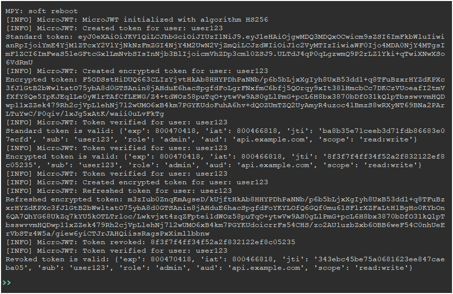

# MicroJWT: Secure JWT Library for MicroPython

 


**MicroJWT** is a production-ready, lightweight JSON Web Token (JWT) library tailored for MicroPython environments. Designed for resource-constrained embedded systems, it offers secure token creation, verification, encryption, and refresh capabilities with minimal dependencies. With advanced security features like AES-256-CBC encryption, PBKDF2 key derivation, and constant-time signature verification, MicroJWT is perfect for IoT applications, secure API authentication, and session management.

---

## Features

- **Secure JWT Handling**: Implements HMAC-SHA256 (HS256) for signing and verification, compliant with RFC 7519.
- **Optional Token Encryption**: Encrypts tokens with AES-256-CBC for secure session storage.
- **PBKDF2 Key Derivation**: Strengthens secret keys for enhanced security.
- **Token Refresh**: Extends token validity without re-authentication.
- **Audience Validation**: Restricts token usage to specific recipients via the `aud` claim.
- **Revocation Support**: Manages an in-memory token revocation list for invalidating tokens.
- **Constant-Time Verification**: Prevents timing attacks during signature validation.
- **MicroPython Optimized**: Uses only standard modules (`hashlib`, `ucryptolib`, `ubinascii`, `json`, `time`, `os`, `binascii`).
- **Configurable Logging**: Includes a lightweight `SimpleLogger` with INFO, WARNING, and ERROR levels, plus silent mode.
- **Robust Input Validation**: Ensures reliability with comprehensive checks on user inputs.

---

## Installation

1. **Clone or Download**:
   ```bash
   git clone https://github.com/armanghobadi/microjwt.git
   ```
   Alternatively, download the `jwt.py` file directly.

2. **Copy to MicroPython Device**:
   Use a tool like `ampy`, `rshell`, or WebREPL to transfer `jwt.py` to your MicroPython device:
   ```bash
   ampy --port /dev/ttyUSB0 put microjwt.py
   ```

3. **Verify Dependencies**:
   Ensure your MicroPython build includes:
   - `hashlib` with `sha256` support
   - `ucryptolib` with AES (CBC mode)
   - Standard modules: `ubinascii`, `json`, `time`, `os`, `binascii`

   **Note**: If `ucryptolib` is unavailable, disable encryption by setting `encrypt=False`.

---

## Usage

### Basic Example
Create and verify a standard JWT token:

```python
from microjwt.jwt import MicroJWT

# Initialize the JWT handler
jwt = MicroJWT(secret_key="your-very-secure-secret-key-32bytes+", algorithm="HS256")

# Create a token
token = jwt.create_token(
    username="user123",
    role="admin",
    additional_claims={"scope": "read:write"},
    audience="api.example.com"
)
print("Token:", token)

# Verify the token
payload = jwt.verify_token(token, audience="api.example.com")
if payload:
    print("Token is valid:", payload)
else:
    print("Token is invalid")
```

### Encrypted Token for Session Storage
Create and verify an encrypted token:

```python
# Create an encrypted token
encrypted_token = jwt.create_token(
    username="user123",
    role="admin",
    additional_claims={"scope": "read:write"},
    audience="api.example.com",
    encrypt=True
)
print("Encrypted Token:", encrypted_token)

# Verify the encrypted token
payload = jwt.verify_token(encrypted_token, audience="api.example.com", encrypted=True)
if payload:
    print("Encrypted token is valid:", payload)
else:
    print("Encrypted token is invalid")
```

### Token Refresh
Refresh an existing token to extend its validity:

```python
new_token = jwt.refresh_token(encrypted_token, encrypted=True)
print("Refreshed Token:", new_token)
```

### Revoke a Token
Invalidate a token before its expiration:

```python
jwt.revoke_token(payload["jti"])
payload = jwt.verify_token(new_token, encrypted=True)  # Returns None (revoked)
print("Revoked token is invalid")
```

---

## Configuration Options

| Parameter       | Description                                      | Default       |
|-----------------|--------------------------------------------------|---------------|
| `secret_key`    | Secret key for signing (min 32 bytes)            | Required      |
| `algorithm`     | HMAC algorithm (only HS256 supported)            | HS256         |
| `ttl`           | Token time-to-live in seconds                    | 3600 (1 hour) |
| `log_level`     | Logging level (INFO, WARNING, ERROR)             | INFO          |
| `silent`        | Suppress logging if True                         | False         |
| `encrypt`       | Encrypt token with AES-256-CBC                   | False         |
| `audience`      | Restrict token to a specific audience             | None          |

---

## Test Screenshot

Below is a screenshot of MicroJWT running on a MicroPython device:

 


**Note**: To update the screenshot, run tests on your device and replace the image with your test output.

---

## Security Considerations

- **Secret Key**: Store the secret key securely (e.g., in a hardware security module or configuration file).
- **Encryption**: Use `encrypt=True` for tokens stored in sessions to prevent exposure of sensitive data.
- **Revocation**: The in-memory revocation list is non-persistent. For production, integrate with persistent storage (e.g., a file or database).
- **PBKDF2 Iterations**: The default 1000 iterations balances security and performance. Adjust (e.g., 500 for speed, 2000 for higher security) based on your device’s capabilities.
- **Timing Attacks**: Constant-time comparison ensures resistance to timing attacks during verification.

---

## Deployment Notes

- **MicroPython Build**: Confirm support for `hashlib.sha256` and `ucryptolib.aes`. If `ucryptolib` is unavailable, disable encryption (`encrypt=False`).
- **Performance**: Test on your target hardware to ensure memory and CPU constraints are met. AES encryption and PBKDF2 are resource-intensive.
- **Persistent Revocation**: Implement a persistent storage solution for `revoked_tokens` in long-running applications.
- **Logging**: Set `log_level="ERROR"` or `silent=True` in production to minimize console output.

---


## License

This project is licensed under the MIT License. See the [LICENSE](LICENSE) file for details.

---

## Contact

For questions or support, contact the maintainers:
- Email: your-email@example.com

Thank you for using MicroJWT! We hope it empowers your secure, embedded applications.